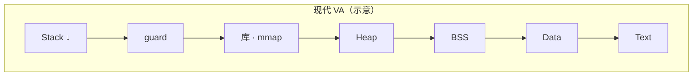

# 1.3.2 OS / LLVM 内存布局（五分区 + 现代 VA）

> 所属：**Talking About Memory** · [← 03 索引](./03-memory-regions.md) · [03.1 Rust 模型 ←](./03-1-rust-memory-model.md)

**视角**：**操作系统 + 链接器 + LLVM** — 读 IR、`static` 进哪段、FFI、HFT 调优、`/proc/maps` 时用。

与 [02 变量深入 · 底层内存槽模型](./02-variables-in-depth.md) 同一层：关心**虚拟地址、段权限、页映射**。

---

## 和 Rust 三分类的映射

| [03.1 Rust 三分类](./03-1-rust-memory-model.md) | OS / 链接器 |
|------------------------------------------------|-------------|
| 栈 | **Stack** |
| 堆 | **Heap**（`brk` / `mmap` 等） |
| 静态 | **Data + BSS**（+ 只读 **`.rodata`**，常与 Text 相邻） |

RFR 日常 safe Rust 以三分类为主；本节补全 **Text / Data / BSS** 与非常规 **mmap**。

---

## 为什么要分区？（OS 逻辑）

1. **权限隔离** — 代码段只读（NX/RX）；数据可 RW；页级保护。
2. **生命周期** — 全局活全程；栈帧随调用；堆由程序 / 分配器管理。
3. **资源优化** — BSS 不占磁盘初值；栈弹帧回收；堆按需向 OS 要页。

每个进程有一块独立**虚拟地址空间**（32 位常见 4GB 用户态；64 位更大）。Rust **不改变** OS 布局，只规定语言层如何安全使用堆栈。

---

## 布局：经典简化 vs 现代 OS

### 核心结论

**现代 Linux / Windows：栈和堆是 VA 里独立（或多块）区域，中间隔 guard、库、mmap，不是同一片连续内存对向生长直到撞车。**

经典「栈 ↓、堆 ↑、中间空闲」图是**入门 / 嵌入式简化**，建立方向直觉即可，**≠ PC 上真实地图**。

### A. 经典简化模型

```text
高地址 ┌─────────────────────────────┐
       │            Stack  ↓         │
       │    （空闲 / 未用区域）        │
       │            Heap   ↑         │
       ├─────────────────────────────┤
       │              BSS            │
       ├─────────────────────────────┤
       │             Data            │
       ├─────────────────────────────┤
       │        Code / Text          │
低地址 └─────────────────────────────┘
```

### B. 现代 Linux / Windows

```text
高地址 ┌─────────────────────────────┐
       │  Stack（每线程，固定上限）   │  ↓ 增长；常见 ~8MB
       │  guard 页                    │
       ├─────────────────────────────┤
       │  动态库 · mmap（大堆块等）    │
       ├─────────────────────────────┤
       │  Heap（brk + mmap）          │
       ├─────────────────────────────┤
       │              BSS            │
       ├─────────────────────────────┤
       │             Data            │
       ├─────────────────────────────┤
       │        Code / Text          │
低地址 └─────────────────────────────┘
```

| | 经典简化 | 现代 OS |
|---|----------|---------|
| 栈堆关系 | 对向生长、共用中间缝 | **独立区域**，中间 guard / 库 / mmap |
| 主要风险 | 「中间挤没」 | 栈 overflow；堆 OOM（各自独立） |



---

## 五分区逐段

### 1. Code / Text

| | |
|---|---|
| **存什么** | 机器指令：`main`、你的 `fn`、`.text` |
| **只读** | 防篡改；多进程可共享物理页 |
| **加载** | 从可执行文件映射 |

### 2. Data

| | |
|---|---|
| **存什么** | **已初始化**全局 / 静态（初值写入镜像） |
| **Rust** | `static GLOBAL_INIT: i32 = 100;` |

只读常量（如 `'static str` 字面量）常在 **`.rodata`**。

### 3. BSS

| | |
|---|---|
| **存什么** | **零初始化**全局 / 静态 |
| **启动** | loader 整段清 0；**不占磁盘初值** |
| **Rust** | `static mut X: i32 = 0;` → 通常 BSS 语义 |

**Rust ≠ C**：`static` **必须写初值**，无 C 式未初始化全局。

```rust
static mut GLOBAL_BSS: i32 = 0;   // BSS
static GLOBAL_INIT: i32 = 100;    // Data
// static mut UNINIT: i32;        // ❌ 编译错误
```

### 4. Heap

| | |
|---|---|
| **存什么** | 动态块：`Box` / `Vec` / `String` payload |
| **扩展** | **`brk` / `mmap`**；大块常独立 mmap |
| **Rust** | 所有权 + drop，无 GC |

### 5. Stack

| | |
|---|---|
| **存什么** | 局部变量、参数、返回地址、寄存器保存 |
| **增长** | 高 → 低（压栈 / 弹栈） |
| **大小** | 固定上限 → stack overflow |

---

## 完整示例：符号落在哪

```rust
static GLOBAL_INIT: i32 = 100;      // Data
static mut GLOBAL_BSS: i32 = 0;     // BSS

fn main() {
    let a = 42;                     // Stack
    let b = Box::new(100);          // b 在 Stack；100 在 Heap

    unsafe { GLOBAL_BSS = 50; }
} // drop 堆；弹 main 帧
```

| 符号 / 数据 | 大致段 |
|-------------|--------|
| `main` 机器码 | Text |
| `GLOBAL_INIT` | Data |
| `GLOBAL_BSS` | BSS |
| `a`、`b`（Box 句柄） | Stack |
| `*b` 的 `100` | Heap |

---

## 非常规映射（仍在 VA 里）

除五分区外，OS 还可映射 **MMIO**、**文件**、**持久内存**：

| 类型 | 作用 | Rust 注意 |
|------|------|-----------|
| **MMIO** | 设备寄存器当内存访问 | `unsafe` + **volatile** |
| **mmap 文件** | 大文件 / IPC / DB | `memmap2` 等；Drop → munmap |
| **NVRAM** | 断电不丢 RAM | 持久化语义看 OS/硬件 API |

```rust
// mmap 文件（Linux + memmap2 示意）
use memmap2::MmapMut;
let mut map = unsafe { MmapMut::map_mut(&file)? };
map[0] = map[0].wrapping_add(1);
```

→ [第 12 章 · 底层内存访问](../Chapter-12-Rust-Without-Standard-Library/06-low-level-memory-access.md) · [第 11 章 FFI](../Chapter-11-Foreign-Function-Interfaces/README.md)

---

## 延伸阅读

- Safe Rust 三分类 → [03.1 Rust 模型](./03-1-rust-memory-model.md)
- 布局 / 对齐 → [第 2 章 · 01 对齐](../Chapter-02-Types/01-alignment.md) · [02 Layout](../Chapter-02-Types/02-layout.md)
- IR：`alloca`（栈）vs heap → [04_Compilers-and-LLVM-Learning/04_Learn-LLVM-17 ch04](../../04_Compilers-and-LLVM-Learning/04_Learn-LLVM-17/part02_src_to_machine/chapter04_ir_basic/README.md)
- 共享 `static` → Book [16.3](../../00-Book/16-fearless-concurrency/16.3-共享状态并发.md) · [16.4 Send/Sync](../../00-Book/16-fearless-concurrency/16.4-Send与Sync.md)
