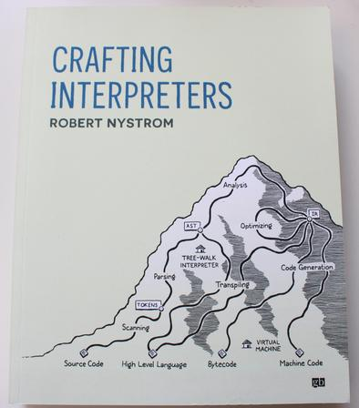

# 01 — Crafting Interpreters

> 所属：[Compilers & LLVM Learning](../README.md) · **立刻能看、零成本**



| 项目 | 说明 |
|------|------|
| **书** | *Crafting Interpreters*（Robert Nystrom / Bob Nystrom） |
| **英文免费在线** | [craftinginterpreters.com](https://craftinginterpreters.com/) |
| **中文在线（推荐）** | [craftinginterpreters-zh-jet.vercel.app](https://craftinginterpreters-zh-jet.vercel.app/)（[GuoYaxiang/craftinginterpreters_zh](https://github.com/GuoYaxiang/craftinginterpreters_zh)） |
| **本目录** | [`本书目录.md`](./本书目录.md) · [`目录结构.md`](./目录结构.md)（同 [01-ER](../../01-ER/目录结构.md) 约定） · `part01_welcome/` · `part02_jlox/` · `part03_clox/` · `backmatter/` |

## 本书定位

Robert Nystrom 的 *Crafting Interpreters* 旨在**从零构建一门编程语言**。全书不靠 yacc/lex 等自动生成器，强调**手写代码**，把「语言实现」从黑箱里拉出来。

| 维度 | 内容 |
|------|------|
| **两个完整项目** | **jlox**（Java · Tree-walk 解释器）→ **clox**（C · 字节码虚拟机） |
| **学什么** | 扫描、解析、静态分析、中间表示、代码生成——封面「编译之山」上的各条路径 |
| **为什么值得读** | 显著提升对**数据结构**与**系统设计**的理解；语言无关，概念可迁移到 Rust |
| **本书产出** | 一份可照着走的**技术路线图**（前端直觉 → VM → 与 **03/04** 后端/IR 衔接） |

**跨章速记** → [ch1 §1.1 · 大概念对照](./part01_welcome/chapter01_introduction/01-why-learn-this-stuff.md)（索引：[速记-大概念对照.md](./速记-大概念对照.md)）

### 编译之山（封面地图）

```text
Source Code
    → Scanning → Tokens
    → Parsing → AST
    → Analysis / Optimizing → IR
    → Code Generation / VM → Bytecode / Machine Code
```

中间 plateau 上常见两条实现路线：**Tree-Walk Interpreter**（Part I）与 **Virtual Machine**（Part II）；Transpiling、Optimizing 等路径在 **02 编译器工程**、**04 LLVM** 中继续展开。

## 为什么先读这本

- **零成本、马上开**：中文在线完整可读，不必等纸质到货。
- **动手密度高**：两趟实现 Lox（Java 树遍历 + C 字节码 VM），建立「前端 → 运行时」直觉。
- **语言无关**：实现用 Java/C，概念直接迁移到 Rust / 本仓库后续 **03《自制编译器》**、**04 LLVM**。

## 与仓库其他部分

| CI 章节 | 仓库对照 |
|---------|----------|
| 词法 / 语法 / AST | **03** 自制编译器 · `00-Book` 宏（第 7 章） |
| 字节码 VM | RFR 第 8 章 async 状态机 · 第 2 章分发 |
| 闭包 / 类 | RFR 第 1、2、3 章 |

## 全书结构（30 章 + 附录）

| 部分 | 章 | 项目 |
|------|:--:|------|
| **I · Welcome** | 1～3 | Lox 语言与「编译之山」 |
| **II · Tree-Walk Interpreter** | 4～13 | **jlox**（Java）：扫描 ch4 → 解析 ch6 → 求值 ch7 → … → 继承 ch13 |
| **III · Bytecode Virtual Machine** | 14～30 | **clox**（C）：字节码 ch14 → 哈希表/GC/闭包 → **Optimization ch30**（最后一章新代码） |
| **Backmatter** | 附录 I～II | Lox 完整语法 · jlox AST Java 生成代码 |

完整章表与在线链接 → [`本书目录.md`](./本书目录.md)

## 精读建议

| 范围 | 说明 |
|------|------|
| **Part I（1～3）** | 先读；建立术语与 Lox 规格 |
| **Part II（4～13）** | 优先动手；树遍历解释器全流程 |
| **Part III（14～30）** | 字节码 VM；与 **04** IR / 优化对照时再精读；**ch30** 对接 O0/O3 |
| **附录** | 写 parser / 查语法时当参考 |

## 待办

- [x] 正文 30 章笔记（**一小节一 md** · 见 [`目录结构.md`](./目录结构.md)）
- [ ] 附录 A1 / A2 笔记
