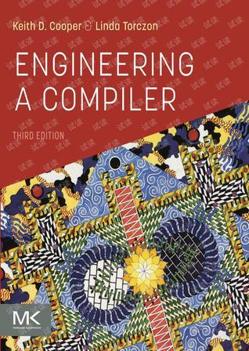

# 02 — 《编译器工程》· Engineering a Compiler

> 所属：[Compilers & LLVM Learning](../README.md) · **以后深入 LLVM / 优化时再开**

| 项目 | 说明 |
|------|------|
| **你选用的版本** | **第三版** *Engineering a Compiler, Third Edition*（封面见上） |
| **作者** | Keith D. Cooper · Linda Torczon |
| **出版社** | Morgan Kaufmann（MK） |
| **俗称** | **橡书**（Oak book）— 与龙书、虎书、鲸书并列的「四大编译教材」之一 |
| **中文译名沿革** | 第一版曾译《编译器工程》；第二版人民邮电《编译器设计》；**第三版暂无正式中文版**，以英文原版为主 |
| **英文** | [Amazon / MK](https://www.amazon.com/Engineering-Compiler-Keith-D-Cooper/dp/0128154128) · ISBN 978-0128154128（2022） |
| **定位** | 现代编译器**工程向**教材：**13 章 + 附录** · 前端 → 基础结构 → 优化 → 代码生成 |
| **本目录** | [`本书目录.md`](./本书目录.md) · [`目录结构.md`](./目录结构.md) · `chapter01_overview/` … |

## 全书四大部分（ch1 之后）

| 部分 | 章 | 内容 |
|------|:--:|------|
| **前端** | 2～4 | 扫描 · 语法分析 · 上下文相关分析 |
| **基础结构** | 5～7 | IR · 过程/运行时抽象 · 代码形态 |
| **优化** | 8～10 | 优化概述 · 数据流分析 · SSA/标量优化 |
| **代码生成** | 11～13 | 指令筛选 · 指令调度 · 寄存器分配 |

完整章表 → [`本书目录.md`](./本书目录.md)

## 与「鲸书」的区别（避免混名）

| | **本书（你选的）** | **鲸书（另一本）** |
|---|-------------------|-------------------|
| 英文 | *Engineering a Compiler* | *Advanced Compiler Design and Implementation* |
| 作者 | Cooper / Torczon | Steven S. Muchnick |
| 俗称 | **橡书** | **鲸书** |
| 侧重 | 编译器**整体工程**与 SSA、优化、寄存器分配 | 商业编译器**深度优化**案例（SPARC / POWER / x86 等） |
| 中文书名 | 常称《编译器工程》/《编译器设计》 | 《高级编译器设计与实现》 |

口头说「编译器工程」时，**你指的是 Cooper 这本**，不是 Muchnick 鲸书。

## 什么时候读

- **不必现在买**：先完成 **01 在线** + **03 纸质** + **04 LLVM 实验**。
- **适合切入的时机**：
  - 读 `04_Learn-LLVM-17` ch07、`ir_samples/optimize_compare/` 时 **O0 vs O3** 看不懂；
  - 想写或读 **LLVM Pass**、理解 **SSA** 与优化在 IR 上「说什么」；
  - RFR **第 9、10 章** + Nomicon 之后，补全「编译器假设 ↔ IR」地图。

## 与仓库其他部分

| 本书主题 | 本仓库对照 |
|----------|------------|
| SSA、优化、寄存器分配 | **04** `chapter07_ir_optimize` · `ir_samples/optimize_compare/` |
| IR、类型与 align | **04** `chapter04`～`05` · RFR 第 2 章 |
| 命名、可寻址性、代码形状 | RFR 第 1 章内存 · 第 2 章 layout |
| 原子 / 内存序与优化 | RFR 第 10 章 · `src/lib.rs` 改 `Ordering` |
| 工具链全貌 | RFR 第 13 章 · `rustc` / LLVM 文档 |

## 其他教材（未列入当前主线）

| 书 | 俗称 | 备注 |
|----|------|------|
| *Compilers: Principles, Techniques, and Tools* | 龙书 | 理论地图；需要时再补 |
| *Modern Compiler Implementation* | 虎书 | 与 **03** 青木书实战路线相近 |
| *Advanced Compiler Design and Implementation* | 鲸书 | Muchnick；比本书更偏「优化百科全书」，可选后读 |

## 待办

- [x] ch1～ch10 笔记（Part III 完成）
- [ ] ch11 及以后
