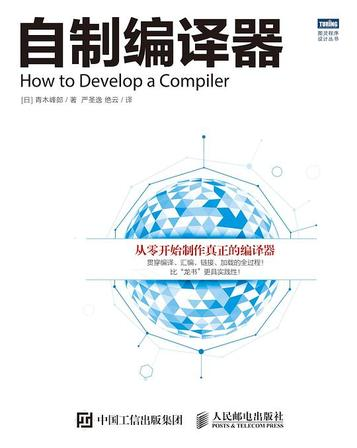

# 03 — 《自制编译器》

> 所属：[Compilers & LLVM Learning](../README.md) · **纸质入门（建议购买）**

| 项目 | 说明 |
|------|------|
| **书名** | 《自制编译器》 |
| **作者** | 青木峰郎（日文：*ふつうのコンパイラをつくろう*） |
| **译者** | 严圣逸、绝云 |
| **出版社** | 人民邮电 · 图灵程序设计丛书 · 自制系列 |
| **参考** | [豆瓣](https://book.douban.com/subject/26806041/) · ISBN 9787115422187 · [官方支持页](https://i.loveruby.net/ja/stdcompiler/) |
| **本目录** | [`本书目录.md`](./本书目录.md) · [`目录结构.md`](./目录结构.md) · [`00-overview.md`](./00-overview.md) |

---

## 一句话

从零构建 **C♭ 编译器（cbc）**：**语法/语义分析 · 中间代码 · x86 汇编生成**，并深入 **汇编器、链接器、加载器** 与硬件环境 — **Java + JavaCC** 实现，产出 **x86 ELF**；适合搞清 **C 运行机制**、**x86 架构**或设计新语言；以 **动手实践** 吃透底层逻辑。

---

## 为什么读这本

| 特点 | 说明 |
|------|------|
| **真编译器** | C♭（含指针）→ **ELF 可执行文件**，非玩具语法 |
| **全链路** | 编译 · 汇编 · 链接 · 加载 · PIC — 比只啃前端更落地 |
| **打破黑盒** | 程序从源码到进程入口的完整路径 |
| **承接 CI** | [01 Crafting Interpreters](../01_Crafting-Interpreters/README.md) 之后系统做「能跑的二进制」 |

---

## 全书结构

| 区块 | 章 | 内容 |
|------|:--:|------|
| **开篇** | 1～2 | 开始制作编译器 · C♭ 和 cbc |
| **第1部分** | 3～6 | 代码分析（词法 · JavaCC · 语法） |
| **第2部分** | 7～11 | 抽象语法树和中间代码 |
| **第3部分** | 12～17 | 汇编代码（x86 · codegen · 栈帧 · 优化） |
| **第4部分** | 18～21 | 链接和加载（ELF · 库 · PIC） |
| **结尾** | 22 | 扩展阅读 |
| **附录** | — | 参考文献 · 在线资料 · 源代码 |

完整章表 → [`本书目录.md`](./本书目录.md)

---

## 与仓库其他部分

| 主题 | 对照 |
|------|------|
| 前端直觉 | **01** CI Part II 扫描/解析 |
| 语义 / IR 理论 | **02** EaC ch4～5 |
| 后端算法 | **02** EaC ch11～13（本书为手写 x86 对照） |
| IR / Pass | **04** Learn LLVM 17 |
| 内存 / 栈 / FFI | **02-RFR** 第 1～2、11 章 |

同系列 *《用 Go 语言自制编译器》*（Monkey/字节码）是另一条线；**本仓库主线采用青木版**。

---

## 状态

- [x] 路线与 [`本书目录.md`](./本书目录.md) 已建
- [ ] ch1 起逐章笔记（按阅读进度）

## 待办

- [ ] 可选：`lab/` 与书中一致的 Java/JavaCC 实验环境
- [ ] 精读时按章建 `chapterNN_*/` 笔记目录
