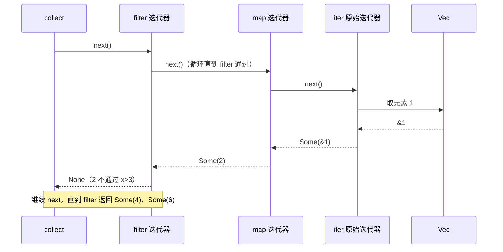

# 13.2.6 迭代器 · 适配器 · 消费器：关系与调用链路

← [13.2.5 适配器/消费器](./13.2.5-适配器与消费器详解.md) · [13.2 hub](./13.2-使用迭代器处理元素序列.md) · 下一条 **[13.2.4 惰性分步演示](./13.2.4-惰性演示-适配器与消费器.md)** · demo：`cargo run -- chain`

> **一句话**：原始迭代器 → 适配器层层包装（仍是迭代器）→ 消费器驱动整条链路 `next()` 跑起来。

```bash
cd Book/13-iterators-closures/13.2-iterators-demo
cargo run -- chain   # 带【map】【filter】标签，看清调用链路
cargo run -- lazy    # 更多消费器示例
```

---

## 一、整体关系总览

| 角色 | 是什么 | 核心 |
|------|--------|------|
| **迭代器** | 基础主体 | `next()` 逐个产出元素 |
| **适配器** | **基于旧迭代器，包装出新迭代器** | 本身也是迭代器；惰性、只包装、**不主动取值** |
| **消费器** | 作用在迭代器之上 | 反复调用 `next()`，汇总成 `Vec`/数字等；**触发执行、耗尽链路** |

**串起来**：**原始迭代器 → 适配器层层包装 → 消费器驱动整条链路**

→ 流水线比喻：[13.2.5 §一](./13.2.5-适配器与消费器详解.md#一通俗比喻)

---

## 二、分步拆解

### 1. 生成「原始迭代器」

`iter()` / `iter_mut()` / `into_iter()` 得到最基础迭代器 — 工作只有一件：被 `next()` 时从集合取元素。

```rust
let v = vec![1, 2, 3];
let base_iter = v.iter(); // 尚未遍历
```

此时：只有迭代器，**无处理逻辑，未开始遍历**。

### 2. 适配器包装（仍是迭代器）

```rust
let base_iter = v.iter();
let map_iter = base_iter.map(|x| x * 2);
// map_iter 是新迭代器：内部持有 base_iter + map 规则
// 全程惰性，不调用 next，不处理元素
```

**链式 = 多层嵌套**：

```rust
let final_iter = v.iter()
    .map(|x| x * 2)      // 第一层：Map<Iter, …>
    .filter(|&x| x > 3); // 第二层：Filter<Map<…>, …>
```

结构示意：

```
final_iter (Filter)
  └─ 内层 map_iter (Map)
       └─ base_iter (Iter) → 集合 v
```

**本质：适配器返回值永远是「新迭代器」** — 能链式的根本原因。

### 3. 消费器驱动整条链路

调用 `collect` / `sum` / `for` 时：

1. 消费器循环调用**最外层**迭代器的 `next()`
2. 外层 `next()` 调用**内层**的 `next()` … 直到**原始迭代器**取元素
3. 元素**从内到外**经过 map、filter 等规则
4. 合格元素交给消费器汇总
5. 原始迭代器返回 `None` → 结束；**整条链路耗尽**

---

## 三、完整代码 + 运行输出

```rust
let v = vec![1, 2, 3];

let iter = v.iter()
    .map(|x| {
        println!("【map】处理元素: {}", x);
        x * 2
    })
    .filter(|&x| {
        println!("【filter】判断元素: {}", x);
        x > 3
    });

println!("=== 所有适配器包装完毕，等待消费 ===");

let result: Vec<_> = iter.collect();
println!("最终结果: {:?}", result);
```

**典型输出：**

```
=== 所有适配器包装完毕，等待消费 ===
【map】处理元素: 1
【filter】判断元素: 2
【map】处理元素: 2
【filter】判断元素: 4
【map】处理元素: 3
【filter】判断元素: 6
最终结果: [4, 6]
```

### 单次 `next()` 链路（以第一个元素为例）



文字版六步：

1. `collect` 调最外层 `next()`
2. filter → 调 map 的 `next()`
3. map → 调原始 `iter` 的 `next()`，拿到 `1`
4. 元素走 map → `2` → filter 判断 → 不通过，filter 继续要下一个
5. 合格元素（4、6）交给 collect 写入 `Vec`
6. 原始 `next()` 返回 `None` → 结束

→ demo：`cargo run -- chain`

---

## 四、核心关系总结

### 1. 身份关系

- **适配器返回值 = 新迭代器** → 可无限链：`iter().a().b().c()`
- **消费器作用对象 = 迭代器** → 写在链**最后**；返回 `Vec`/数字等，**不再是迭代器**

### 2. 行为关系

| 阶段 | 状态 |
|------|------|
| 停在适配器 | **惰性休眠** — 只存规则 |
| 调用消费器 | **唤醒整条链路** — 逐元素 `next()` |

### 3. 生命周期

- **适配器**：逻辑嵌套，旧迭代器被新迭代器**持有**（包装，不「销毁」语义上的数据源）
- **消费器**：跑完后**整条链路耗尽**，不能再次产出 → [13.2.4 §五](./13.2.4-惰性演示-适配器与消费器.md#五消费后不能复用)

---

## 五、结构图示

```
原始集合 (Vec)
    ↓
原始迭代器 iter()     ← 产出 &T
    ↓  ↑ next 回溯
适配器 map            ← 本身也是 Iterator
    ↓  ↑
适配器 filter         ← 本身也是 Iterator
    ↓
消费器 collect/sum/for ← 启动遍历 + 汇总（非迭代器）
    ↓
最终结果 Vec / 数字 / 副作用
```

---

## 六、两个常见误区

| 误区 | 纠正 |
|------|------|
| 适配器不是迭代器？ | **适配器返回的都是迭代器**，所以能 `.map().filter().collect()` |
| 消费器会生成新迭代器？ | **不会**。返回普通数据，链式**到此结束** |

---

## 七、一句话

**迭代器是主体，适配器是「套娃式新迭代器」，消费器是「按 next 把套娃拆开并收尾」。**

---

## demo 对照

| 命令 | 对应 |
|------|------|
| `cargo run -- chain` | §三 完整链路打印 |
| `cargo run -- lazy` | [13.2.4](./13.2.4-惰性演示-适配器与消费器.md) 多场景 |
| Filter 伪代码 | [13.2.1 §三](./13.2.1-迭代器精讲.md#三适配器惰性--消费器触发执行) |
